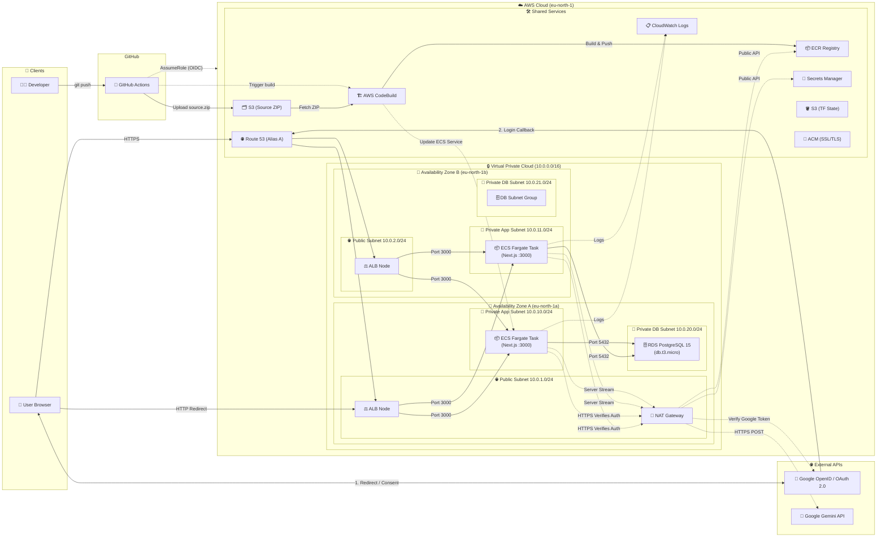
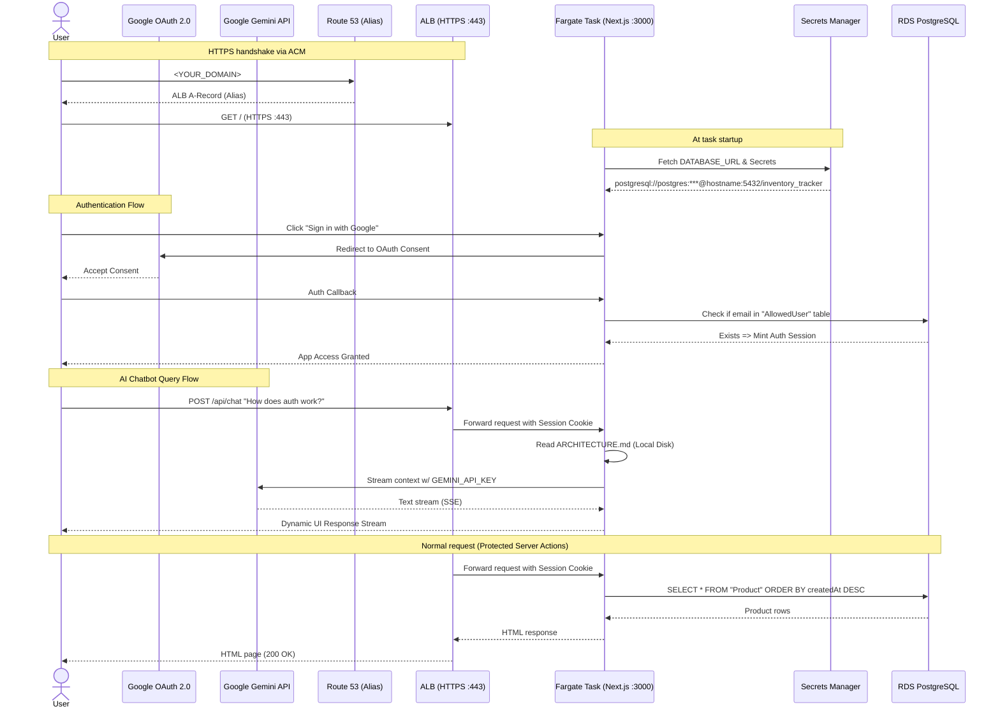

# Inventory Tracker — Technical Documentation

> **Environment:** Test/Learning | **Region:** `eu-north-1` (Stockholm)  
> **Last deployed:** 2026-03-25 | **Managed by:** Terraform IaC

---

## Table of Contents

1. [Application Overview](#1-application-overview)
2. [Architecture Diagram](#2-architecture-diagram)
3. [Infrastructure Components](#3-infrastructure-components)
4. [Networking](#4-networking)
5. [Security Model](#5-security-model)
6. [Application Stack](#6-application-stack)
7. [Data Model](#7-data-model)
8. [Deployment Workflow](#8-deployment-workflow)
9. [Operational Runbook](#9-operational-runbook)
10. [Known Gotchas & Lessons Learned](#10-known-gotchas--lessons-learned)

---

## 1. Application Overview

A full-stack **inventory tracking** web application that allows users to:

- Securely authenticate via Google OpenID (OAuth 2.0)
- View all products in an inventory table
- Search products by name or SKU
- Add new products (name, SKU, quantity)
- Update product quantities inline
- Delete products
- **Consult the technical design via the integrated Architect AI Chatbot.**

NOTE: While this app and CI/CD pipelines are fully working this public DEMO repo is meant to be as read only. In order to fully set it up GA Actions with secrets and Google Cloud APIs for login and AI chatbox needs to be set up

| Attribute        | Value                                                                 |
|------------------|-----------------------------------------------------------------------|
| Framework        | Next.js 16 (App Router, Server Actions, Standalone output)            |
| Language         | TypeScript                                                            |
| Authentication   | Auth.js v5 (NextAuth) via Google OAuth 2.0                            |
| AI Integration   | Google Gemini API (`@google/genai` SSE Stream)                        |
| ORM              | Prisma 6.x                                                            |
| Database         | PostgreSQL 15 (AWS RDS) / Local SQLite                                |
| Container        | Docker (multi-stage build, `node:20-alpine`)                          |
| Hosting          | AWS ECS Fargate                                                       |
| Public URL       | `https://<YOUR_DOMAIN>`                                               |

---

## 2. Architecture Diagram



### Request Flow



---

## 3. Infrastructure Components

### Compute — ECS Fargate

| Setting              | Value                          |
|----------------------|--------------------------------|
| Cluster              | `inventory-tracker-cluster`    |
| Service              | `inventory-tracker-service`    |
| Task Definition      | `inventory-tracker:1`          |
| Launch Type          | FARGATE                        |
| Platform             | Linux x86_64                   |
| CPU                  | 512 units (0.5 vCPU)           |
| Memory               | 1024 MiB (1 GB)                |
| Desired Count        | 1                              |
| Container Port       | 3000                           |
| Health Check         | `GET /` → HTTP 200             |
| Health Check Grace   | 120 seconds                    |

### Database — RDS PostgreSQL

| Setting              | Value                                                          |
|----------------------|----------------------------------------------------------------|
| Identifier           | `inventory-tracker-db`                                         |
| Engine               | PostgreSQL 15                                                  |
| Instance Class       | `db.t3.micro`                                                 |
| Storage              | 20 GB gp3, encrypted (AES-256)                                |
| Multi-AZ             | No (test environment)                                          |
| Public Access        | No                                                             |
| Endpoint             | `<RDS_INSTANCE_IDENTIFIER>.<RANDOM_TOKEN>.<REGION>.rds.amazonaws.com:5432` |
| Database Name        | `inventory_tracker`                                            |
| Master User          | `postgres`                                                     |
| Password Management  | `manage_master_user_password = false` (Terraform-controlled)  |
| Backup Retention     | 7 days                                                         |
| Final Snapshot       | Disabled (test environment)                                    |

### Load Balancer — ALB

| Setting          | Value                                   |
|------------------|-----------------------------------------|
| Name             | `inventory-tracker-alb`                 |
| Scheme           | Internet-facing                         |
| Protocol         | HTTPS (port 443)                        |
| SSL Certificate  | ACM (Managed Certificate)                   |
| HTTP Redirect    | Port 80 → 443 (HTTP 301)                |
| Target Group     | `inventory-tracker-tg`                  |
| Target Protocol  | HTTP port 3000                          |
| Health Check     | `GET /` — expects 200                   |
| Header Security  | Drops invalid HTTP headers              |

### Container Registry — ECR

| Setting              | Value                          |
|----------------------|--------------------------------|
| Repository           | `inventory-tracker`            |
| Tag Mutability       | Mutable (Test Environment)    |
| Image Scan on Push   | Enabled                        |
| Encryption           | AES-256                        |
| Image URI            | `<AWS_ACCOUNT_ID>.dkr.ecr.eu-north-1.amazonaws.com/inventory-tracker:latest` |

### Secrets — AWS Secrets Manager

| Setting      | Value                                              |
|--------------|----------------------------------------------------|
| Secret Name  | `inventory-tracker/app-db-url`                   |
| Format       | Plain string — full Prisma `DATABASE_URL`           |
| Parameters   | `?connection_limit=1&pool_timeout=30&connect_timeout=10` |
| Password     | Automatically **URL-encoded** by Terraform (`urlencode()`) |
| Secret Name  | `inventory-tracker/gemini-api` *(example)*         |
| Format       | Plain string — `GEMINI_API_KEY` for GenAI service   |


---

## 4. Networking

```
VPC: 10.0.0.0/16
├── Public Subnets (ALB + NAT Gateway)
│   ├── 10.0.1.0/24  (eu-north-1a)
│   └── 10.0.2.0/24  (eu-north-1b)
├── Private App Subnets (Fargate)
│   ├── 10.0.10.0/24 (eu-north-1a)
│   └── 10.0.11.0/24 (eu-north-1b)
└── Private DB Subnets (RDS)
    ├── 10.0.20.0/24 (eu-north-1a)
    └── 10.0.21.0/24 (eu-north-1b)
```

### Security Groups

| SG Name   | Inbound                            | Outbound                           |
|-----------|------------------------------------|------------------------------------|
| `alb-sg`  | TCP :80, :443 from `0.0.0.0/0`    | TCP :3000 → `app-sg`               |
| `app-sg`  | TCP :3000 from `alb-sg`           | TCP :443 → `0.0.0.0/0` (NAT), TCP :5432 → `db-sg` |
| `db-sg`   | TCP :5432 from `app-sg`           | _(none)_                           |

> Fargate tasks have no public IP. Outbound internet access for ECR/Secrets Manager goes via the NAT Gateway.

---

## 5. Security Model

| Control                  | Implementation                                        |
|--------------------------|-------------------------------------------------------|
| Authentication           | Google OpenID OAuth 2.0 implemented via Auth.js (NextAuth v5)|
| Authorization            | Strict `AllowedUser` database validation upon Sign-In callback |
| Server Actions           | API & CRUD calls strongly protected via `await auth()` check |
| Secrets at rest          | DATABASE_URL stored in Secrets Manager (not env vars) |
| Secrets in transit       | Fetched via HTTPS at task startup by ECS agent        |
| DB credentials           | Never in source code or Terraform state (sensitive var) |
| DB network isolation     | RDS in private subnet, no public endpoint             |
| Container image scanning | ECR scan on every push                                |
| Encryption at rest       | RDS storage encrypted (AES-256), ECR encrypted        |
| IAM least privilege      | ECS task execution role scoped to: `ECR:GetAuthorizationToken`, `ECR:BatchGetImage`, `logs:*`, `secretsmanager:GetSecretValue` |
| S3 state backend         | Terraform state in S3 with encryption                 |
| Infrastructure Audit     | Evaluated manually against `tfsec` AWS guardrails     |

---

## 6. Application Stack

### Source Layout

```text
GCLI31pro_app/
├── app/
│   ├── actions.ts          # Protected Next.js Server Actions (CRUD)
│   ├── page.tsx            # Main page (Server Component) with auth checks
│   ├── layout.tsx          # Root layout
│   ├── api/auth/           # Auth.js dynamic route handlers
│   └── api/chat/           # SSE Streaming endpoint for Gemini Chatbot
├── components/
│   ├── ProductClient.tsx   # Client component (search, add, edit UI)
│   ├── auth-components.tsx # Sign in / Sign out UI components
│   └── ChatBox.tsx         # Dark mode floating AI chat client
├── lib/
│   └── prisma.ts           # Prisma client singleton
├── prisma/
│   ├── schema.prisma       # PSQL Data model (inc. Auth & Products)
│   └── schema.sqlite.prisma# Local dev SQLite model
├── terraform/              # All IaC Infrastructure
├── auth.ts                 # Central Auth.js Configuration
├── Google-OpenID-Setup.md  # Detailed setup manual for OAuth credentials
├── GCP-Gemini-Setup.md     # Setup manual for Gemini API integration
├── Dockerfile              # Multi-stage production build (copies ARCHITECTURE.md)
└── ARCHITECTURE.md         # This file
```

### Dockerfile — Build Stages

| Stage      | Base Image        | Purpose                                    |
|------------|-------------------|--------------------------------------------|
| `base`     | `node:20-alpine`  | Shared base with libc compat               |
| `deps`     | `base`            | Install production dependencies            |
| `builder`  | `base`            | Copy deps, run `prisma generate`, `next build` |
| `runner`   | `base`            | Copy `.next/standalone` — minimal runtime  |

The `standalone` output bundles only the files needed to run the server, keeping the image small.

### Terraform Layout

```
terraform/
├── versions.tf     # Provider constraints + S3 backend config
├── providers.tf    # AWS provider + default tags
├── variables.tf    # All input variables (with descriptions)
├── main.tf         # All resources: VPC, SGs, RDS, ECR, IAM, ECS, ALB
├── outputs.tf      # App URL, ECR URI, cluster/service names, subnet/SG IDs
└── .gitignore      # Excludes .tfstate, .tfplan, *.tfvars
```

---

## 7. Data Model

```prisma
model Product {
  id        Int      @id @default(autoincrement())
  name      String
  sku       String   @unique
  quantity  Int      @default(0)
  createdAt DateTime @default(now())
  updatedAt DateTime @updatedAt
}

// NextAuth.js Standard Models
model User { ... }
model Account { ... }
model Session { ... }
model VerificationToken { ... }

// Core Authorization Model representing allowed logins
model AllowedUser {
  email     String   @id
  createdAt DateTime @default(now())
}
```

Managed via **Prisma Migrate**. Schema changes are applied by running a one-off Fargate task with `prisma migrate deploy` (see §8).

---

## 8. Deployment Workflow

### Automated Deployment (GitHub Actions)

The deployment workflow is automated using GitHub Actions, separated into two main pipelines:

#### 1. Infrastructure Deployment (`infra-deploy.yml`)
- **Trigger:** Any push to the `main` branch that modifies files in the `terraform/` directory.
- **Actions:**
  - Initialises Terraform.
  - Runs `terraform plan`.
  - Executes `terraform apply -auto-approve` (only on `main`).
- **Required Secrets:** `GH_ROLE_ARN` (OIDC IAM Role ARN), `TF_VAR_DB_PASSWORD`.

#### 2. Infrastructure Teardown (`infra-destroy.yml`)
- **Trigger:** Manual execution via `workflow_dispatch`.
- **Safety:** Requires the user to type "DESTROY" into an input field to proceed.
- **Actions:** Performs `terraform destroy -auto-approve`.
- **Required Secrets:** `GH_ROLE_ARN` (OIDC IAM Role ARN), `TF_VAR_DB_PASSWORD`.

#### 3. Application Deployment (`app-deploy.yml`)
- **Trigger:** Any push to the `main` branch that *does not* modify Terraform files.
- **Actions:**
  - Authenticates to AWS via OIDC using `GH_ROLE_ARN`.
  - Retrieves S3 bucket and CodeBuild project names from Terraform outputs.
  - Packages the application code into `source.zip`.
  - Uploads the ZIP to the S3 source bucket.
  - Triggers the AWS CodeBuild project to build the image, run migrations, and update ECS.
- **Required Secrets:** `GH_ROLE_ARN` (OIDC IAM Role ARN).

---

### Manual Deployment (Reference)

```powershell
# 1. Set DB password for this session
$env:TF_VAR_db_password = "YourPassword"
$env:AWS_PROFILE = "iac"

# 2. Provision infrastructure
cd terraform
terraform init
terraform validate
terraform plan -out=tfplan
terraform apply tfplan

# 3. Authenticate Docker to ECR (deprecated for local)
# Now handled by AWS CodeBuild internally.

# 4. Build and Push via AWS Cloud Build
# Package source and upload to S3, then trigger CodeBuild.

$BUCKET = (terraform output -raw source_bucket_name)
$PROJECT = (terraform output -raw codebuild_project_name)

# Move to project root to capture application code
cd ..

# Create ZIP (excluding redundant files)
Get-ChildItem -Path . -Exclude "node_modules", ".next", "terraform", "source.zip", ".git" | Compress-Archive -DestinationPath source.zip -Force

# Upload to S3
aws s3 cp source.zip s3://$BUCKET/source.zip

# Trigger Build & Deploy (Now includes automated migrations!)
aws codebuild start-build --project-name $PROJECT
```

### Subsequent Image Deploys (code changes only)

```powershell
# Simply re-zip and upload (from project root)
Get-ChildItem -Path . -Exclude "node_modules", ".next", "terraform", "source.zip", ".git" | Compress-Archive -DestinationPath source.zip -Force
aws s3 cp source.zip s3://$BUCKET/source.zip
aws codebuild start-build --project-name $PROJECT
```

### Teardown

```powershell
terraform destroy
```

> ⚠️ This deletes ALL resources including the RDS database. Backup data first if needed.

---

## 9. Operational Runbook

### Check App Status

```powershell
aws ecs describe-services `
  --cluster inventory-tracker-cluster `
  --services inventory-tracker-service `
  --region eu-north-1 `
  --query "services[0].{running:runningCount,pending:pendingCount,event:events[0].message}"
```

### View Live Logs

```powershell
# Get the current running task's log stream
$ID = (aws ecs list-tasks --cluster inventory-tracker-cluster `
  --region eu-north-1 --desired-status RUNNING `
  --query "taskArns[0]" --output text).Split("/")[-1]

(aws logs get-log-events --region eu-north-1 `
  --log-group-name /ecs/inventory-tracker `
  --log-stream-name "ecs/inventory-app/$ID" `
  --output json | ConvertFrom-Json).events | ForEach-Object { $_.message }
```

### Update DATABASE_URL Secret

Terraform now manages the creation of the secret with the correct URL-encoding and connection limits. If you need to rotate the password:

1. Update your `TF_VAR_db_password` environment variable.
2. Run `terraform apply`.
3. Force a redeploy of the ECS service.

```powershell
# Force redeploy so running tasks pick up the new secret version
aws ecs update-service --cluster inventory-tracker-cluster `
  --service inventory-tracker-service --region eu-north-1 --force-new-deployment
```

### Database Migrations

Database migrations are **now fully automated** as part of the `aws codebuild start-build` process. The Buildspec triggers a one-off Fargate task to run `npx prisma migrate deploy` before updating the main application service.

If you ever need to run a manual migration for troubleshooting:
1. Update `ecs-overrides.json` to include the `prisma migrate deploy` command.
2. Ensure you are in the project root.
3. Run the following command (requires `$SUBNET` and `$SG` variables):

```powershell
aws ecs run-task `
  --cluster inventory-tracker-cluster `
  --task-definition inventory-tracker `
  --region eu-north-1 --launch-type FARGATE `
  --network-configuration "awsvpcConfiguration={subnets=[$SUBNET],securityGroups=[$SG],assignPublicIp=DISABLED}" `
  --overrides file://ecs-overrides.json
```

---

## 10. Known Gotchas & Lessons Learned

| # | Issue | Root Cause | Fix |
|---|-------|-----------|-----|
| 1 | **Terraform SG cycle error** | Inline `ingress`/`egress` blocks with cross-references between SGs create circular dependencies | Use empty `aws_security_group` shells + separate `aws_security_group_rule` resources |
| 2 | **SG name `sg-*` rejected** | AWS reserves the `sg-` prefix for its own resource IDs | Use `*-sg` suffix (e.g. `alb-sg`, `app-sg`) |
| 3 | **RDS password always wrong** | `terraform-aws-modules/rds v6` defaults `manage_master_user_password = true`, silently ignoring `var.db_password` | Explicitly set `manage_master_user_password = false` in the RDS module block |
| 4 | **Special chars in password break DATABASE_URL** | AWS-generated passwords contain `@`, `:`, `/` which break URL parsing | URL-encode with `[Uri]::EscapeDataString($password)` before embedding in the connection string |
| 5 | **`npx prisma migrate deploy` uses Prisma 7** | `npx` without a version downloads the latest (7.x), which has breaking schema changes | Pin the version: `npx prisma@6 migrate deploy` |
| 6 | **AWS CLI JSON parsing fails on Windows** | PowerShell single-quoted strings strip double-quotes, `output = JSON` (uppercase) is invalid | Use `file://` for complex JSON args; set `output = json` (lowercase) in AWS config |
| 7 | **UTF-8 BOM breaks `file://` JSON** | `Out-File -Encoding utf8` adds a BOM; AWS CLI JSON parser rejects it | Use `-Encoding ascii` since JSON is ASCII-safe |
| 8 | **"Failed to find Server Action"** | Browser caches JS bundle with old server action IDs after ECS redeployment | Hard refresh (`Ctrl+Shift+R`) after any ECS forced redeployment |
| 9 | **`$env:TEMP` path breaks `file://`** | Windows backslash paths are invalid in `file://` URIs | Save the file to the current directory and use a relative `file://filename.json` |
